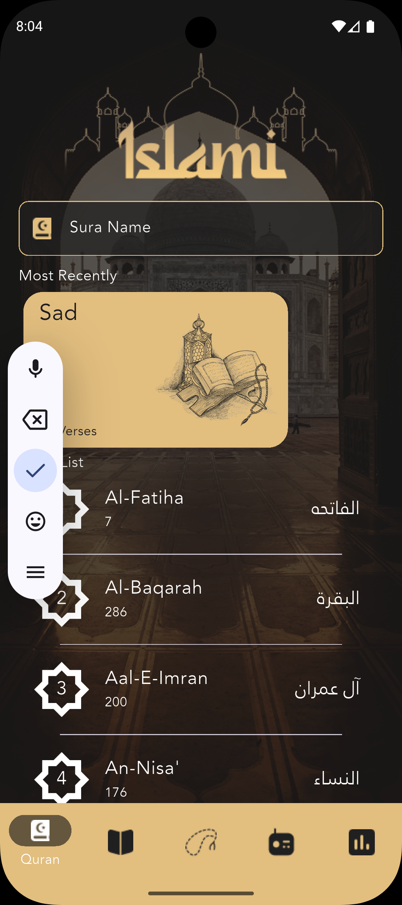
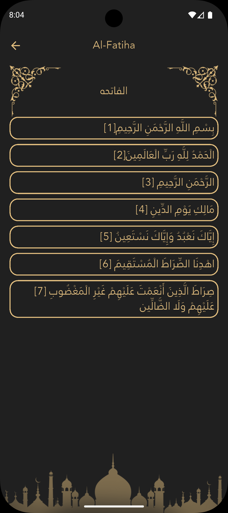
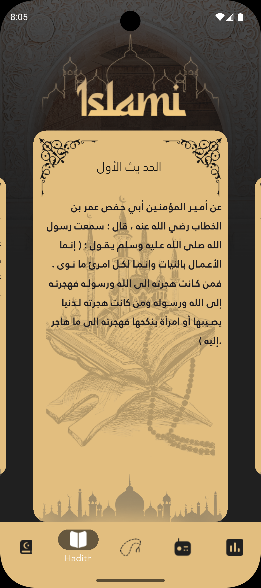
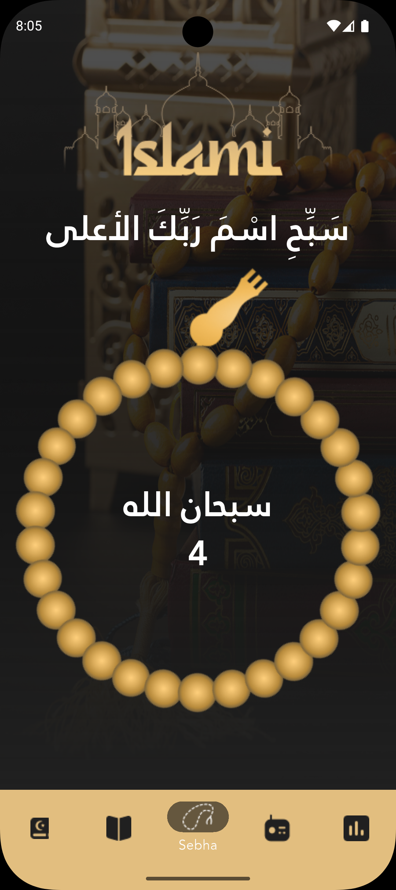
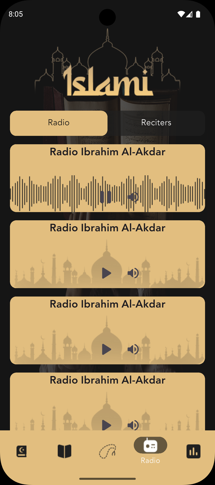
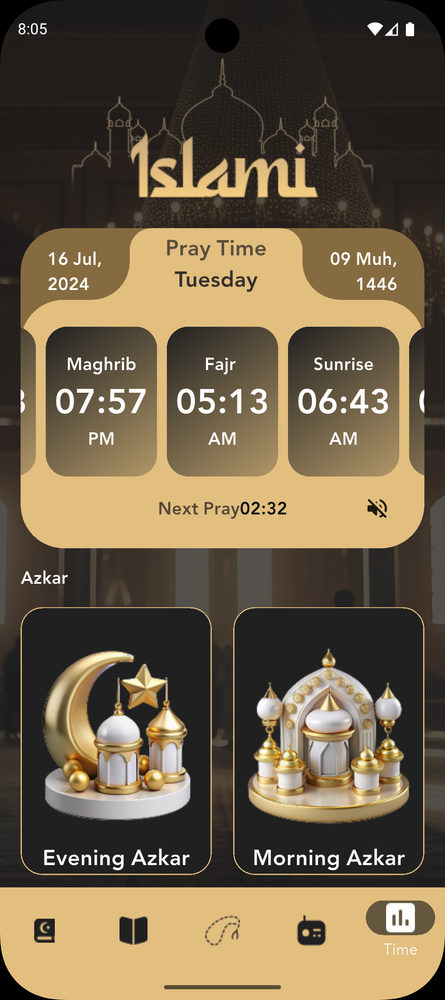

# ☪️ Islami — Flutter Islamic Companion App

An offline‑first Islamic companion app built with Flutter. It bundles the full Quran and a collection of Hadith as local text files, and adds a digital Sebha (tasbih counter), prayer‑time cards, an Azkar section, and a Radio tab — all wrapped in a dark, gold‑accented theme.

---

## 📸 Screenshots

### Onboarding

<table>
<tr>
<td align="center"></td>
<td align="center"></td>
<td align="center"></td>
</tr>
<tr>
<td align="center" colspan="3">


</td>
</tr>
</table>

A five‑page introduction shown the first time the app opens: **Welcome To Islami App**, a community welcome message, **"Reading the Quran"**, **"Bearish"** (dhikr/remembrance of Allah), and **"Holy Quran Radio"** — each pairing a full‑screen illustration with a short line of text. Users can step through with **Next**/**Back** or jump straight in with **Finish**, after which the intro is skipped on future launches.

---

### Quran

<table>
<tr>
<td align="center"></td>
<td align="center"></td>
</tr>
</table>

The app's default tab. Lists all 114 Surahs (English and Arabic names, plus verse count) and includes a live search field that matches against either the English or Arabic name as you type. A **Most Recently** row keeps quick access to the last 10 Surahs opened. Tapping a Surah opens the full text — loaded from a local `.txt` file for that Surah — verse by verse, each numbered and right‑aligned for Arabic script.

---

### Hadith

<table>
<tr>
<td align="center"></td>
</tr>
</table>

A swipeable carousel of Hadith cards, each showing a title and its full text pulled from a bundled collection of local Hadith files. Tapping a card opens the same full‑screen reading view used for Surahs.

---

### Sebha (Tasbih Counter)

<table>
<tr>
<td align="center"></td>
</tr>
</table>

A digital prayer‑bead counter: tapping the bead graphic increments a counter and rotates the beads accordingly, cycling the displayed phrase through **"سبحان الله" → "الحمد لله" → "الله أكبر"** every 33 counts, matching the traditional Tasbih cycle.

---

### Radio

<table>
<tr>
<td align="center"></td>
</tr>
</table>

A tabbed **Radio / Reciters** view listing stations as cards with play/pause and mute controls. The player UI is fully built out, though actual audio streaming isn't wired up yet — no audio‑playback package is included in the project's dependencies.

---

### Prayer Times & Azkar

<table>
<tr>
<td align="center"></td>
</tr>
</table>

Shows the day's six prayer times (Fajr, Sunrise, Dhuhr, Asr, Maghrib, Isha) as a swipeable carousel of cards, alongside the Gregorian/Hijri date and a countdown to the next prayer. Below that, an **Azkar** grid links out to Evening, Morning, Waking, and Sleeping Azkar. The prayer times shown are currently static placeholder values rather than calculated for the device's date or location.

---

## 🧱 Technical Details

### Packages

| Package | Purpose |
|---|---|
| `carousel_slider` | Powers the swipeable Hadith cards and the prayer‑time card carousel |
| `introduction_screen` | Drives the 5‑page onboarding flow shown on first launch |
| `flutter_native_splash` | Generates the native splash screen per platform |
| `cupertino_icons` | iOS‑style icon set |

Dart SDK constraint (from `pubspec.yaml`): `^3.10.3`

### Content & Data

Everything in the app is bundled locally rather than fetched from a network API:

- **Quran** — Surah names and verse counts are hardcoded lists (`lib/utils.dart`); the full text of each Surah is a separate `.txt` file under `assets/Suras/Suras/`, loaded on demand when a Surah is opened.
- **Hadith** — 49 individual `.txt` files under `assets/Hadeeth/Hadeeth/` (title on the first line, body on the second), all read into memory once at app startup via `loadHadithList()` in `main.dart`.
- Custom Arabic‑capable fonts are bundled under `assets/font/` and registered as the `f1` font family.

### Code Architecture

- The app has a single **bottom `NavigationBar`** (`main.dart`) that swaps between five top‑level screens — `QuranScreen`, `HadithScreen`, `SebhaScreen`, `RadioScreen`, `TimeScreen` — using simple index‑based state (`currentPageIndex`), no named routes or navigation package.
- Reading a Surah or a Hadith both push to the same shared `ContentViewer` screen, distinguished by a `sura: bool` flag, so one screen handles both content types.
- There's no external state‑management package in use (an empty `IslamiProvider` class exists in `lib/islami_provider.dart` but isn't wired into the app) — screens manage their own local state with `StatefulWidget`/`setState`.
- Sizing throughout is done via ratio helpers in `lib/utils.dart` (`widthRatio`, `heightRatio`, `getWidth`, `getHeight`) that scale against a 430×932 reference screen.
- Folder layout:

```
lib/
├── intoscreen.dart        # 5-page onboarding flow
├── quran_screen.dart      # Surah list, search, "Most Recently"
├── hadith.dart            # Hadith carousel
├── content_viewer.dart    # Shared full-text reader for Surahs and Hadith
├── sebha_screen.dart      # Tasbih counter
├── radio.dart             # Radio/Reciters tab UI
├── time_screen.dart       # Prayer times + Azkar grid
├── models/
│   └── hadith_model.dart  # Hadith data class (title, content)
├── theme.dart             # App theme
├── utils.dart             # Shared data lists, colors, sizing helpers, Hadith loader
└── main.dart              # Entry point, bottom navigation shell
```

### Supported Platforms

The repository contains platform scaffolding for **Android, iOS, macOS, Linux, Windows, and Web**.
